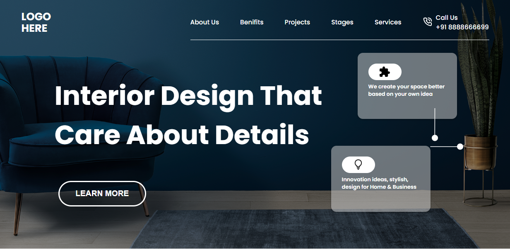

# Project_10 - HTML  and CSS 

---

## Project 10 [Live Link](https://project-10-themohitgupta.netlify.app)

---
## What I learned from this Project?

- Learnd about **transform** in css.
- Learnd about **background-image** in css.

---

### This Project took me around **2 hours** to complete.

---

---
